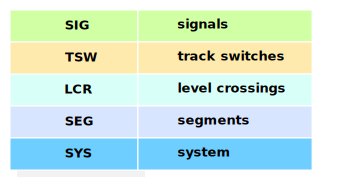
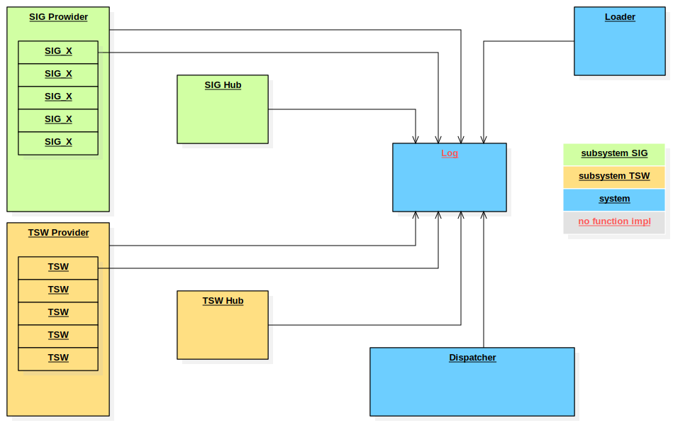

# The DSTW Project

## modules
 

## state of implementaion

### implemented and tested:
-   load project data
    -   create signals of different signal types acc. to project data
    -   create track switches
-   process track switch and signal telegrams from GUI and field
-   generate track switch and signal telegrams to GUI and field

## central error logging
There is no error handling in the individual components.
All errors are reported to the central error log.
Further error handling / reactions / statistics will be implemented here.

## testing
### module tests
Due to the Interface Locator (IL) any application component instance can be replaced by a mock instance.
Sample: test setup for Dispatcher component 

### system tests
System tests (currently) have two stimulation points
-   project data
-   telegrams from field and GUI

Expectation takes place at the Com interface
-   telegrams to field and GUI

## code coverage
for current current code coverage see [coverage.md](testing/coverage.md)

