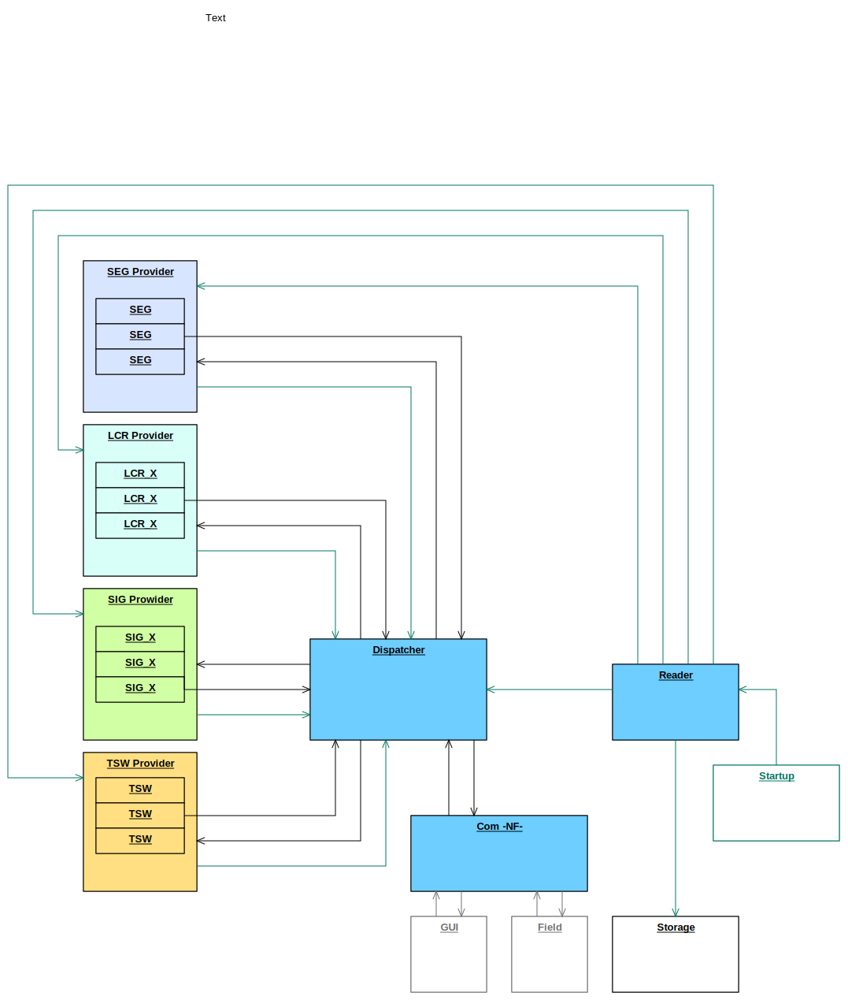

# DSTW
## the project
An implementation of an interlocking control logic (ICL) which represents the states of field elements like signals or track switches and communicates with control panels (GUIs) and the real field elements.

It consists of the following components:
- TSW: track switches
- SIG: signals
- LCR: level crossings
- SEG: track segments
- SYS: commonly used system
- COM: TCP communication to field and GUI

### goals
The project does not intend an implementation that would work in a real digital interlocking (DSTW).

The aim is to
- apply and demonstrate techniques to meet security integrity level 4 (SIL4).
- show a completely different approach than the [model driven](Clinch.md) one I happened to experience.
- use as much modern C++ as possible
- gain AI usage experience

## components interaction overview

## topics
- [SIL4](SIL4.md)
- [AI usage](AI.md)
- [testing](testing/README.md)
- [transition tables](specification/doc/transition_tables.md)
- [code coverage](testing/coverage_tools.md)
- [how to build](make/README.md)
- [current lines of code](CLOC.md)
