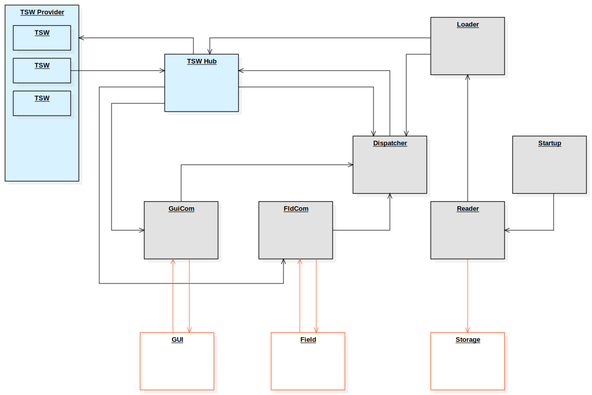
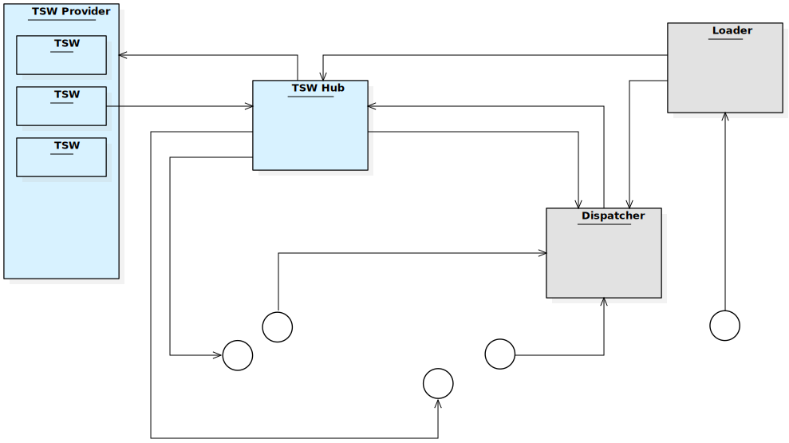
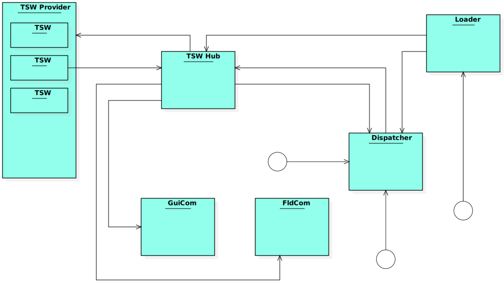

# The ICL Project

## project overview

## state of implementaion

# test environment mocking
Every component can be substituded by a mock.

## code coverage
for current current code coverage see [coverage.md](testing/coverage.md)
