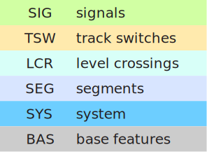
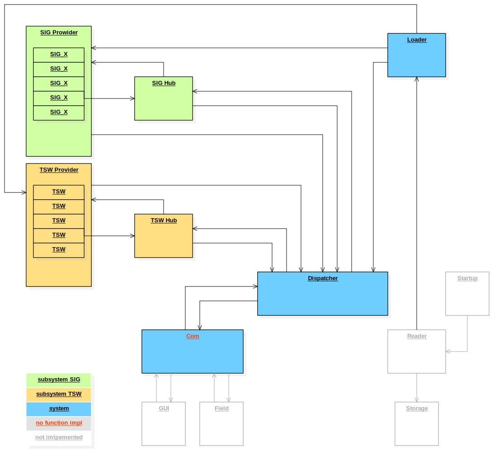

# release 2023-11 _Maggie_

## components
 

## modules

## central error logging
There is no error handling in the individual components.
All errors are reported to the central error log.
Further error handling / reactions / statistics will be implemented here.

## framing
-   fictive telegram structures
-   fictive project data structures

## application
-   BAS
    -   provide main base features
-   SYS
    -   Dispatcher
    -   Loader (for site specific data, _Projektierung_)
    -   Log (without functionality)
    -   Com (without functionality)
-   TSW (track switches)
    -   TSW
    -   TSW Provider
    -   TSW Hub
-   SIG (signals)
    -   SIG_X
    -   SIG Provider
    -   SIG Hub

### SYS
#### Dispatcher
-   full functionality for TSW, SIG
    -   register element names and positions from subsystem _Providers_
    -   distribute incoming telegrams from _Com_ to subsystem _Hubs_
        -   from field
        -   from GUI
    -   forward and label telegrams from _Hubs_ to _Com_
#### Loader
-   full functionality for TSW, SIG
    -   distribute data to subsystem _Providers_
#### subsystem TSW
-   TSW element
    -   commands from GUI: WU, left, right
    -   commands to field
    -   states from field
    -   states to GUI 
    -   correct state processing
-   TSW Provider
    -   full functionality
        -   load site specific data, _Projektierung_
        -   register element positions at _Dispatcher_
        -   provide elements to _TSW Hub_
-   TSW Hub
    -   full functionality
        -   forward telegrams to elements at _TSW Provider_
            -   from field
            -   from GUI
        -   forward commands from elements as telegrams to _Dispatcher_
            -   to field
            -   to GUI
#### subsystem SIG
-   SIG element
    -   different signal types
        -   SIG_H main signal
        -   SIG_N support signal with speed indicator
        -   SIG_H_N main and support signal with speed indicator
    -   commands and states processed depending on signal type
-   SIG Provider
    -   full functionality
        -   load site specific data, _Projektierung_
            -   create different signal types dependent on data
        -   register element positions at _Dispatcher_
        -   provide elements to _SIG Hub_
-   SIG Hub
    -   full functionality
        -   forward telegrams to elements at _SIG Provider_
            -   from field
            -   from GUI
        -   forward commands from elements as telegrams to _Dispatcher_
            -   to field
            -   to GUI
## testing
### test environment
test environment based on CppUTest for module tests and system tests
### module tests
test all modules, achieve full source code coverage
### system tests
test from incoming to outgoing telegrams
### coverage
measure application code coverage of module tests
-   use gcc built in gcov tool
-   evaluate bullseye coverage