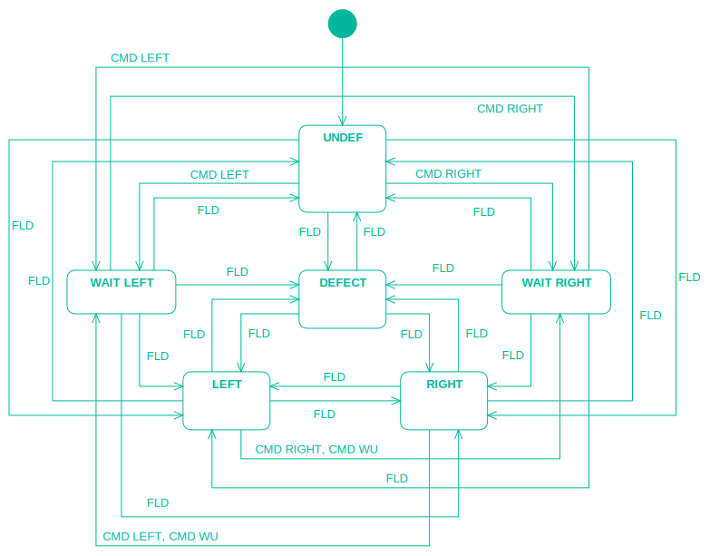

# transition tables

## sample: transitions TSW


## valid transitions

```
The track switch (TSW) has only 6 different states.
State information from field can cause any transition,
except transitions to WAIT states.

thats adds up to
all transitions: 6 X 6
minus 6 transitions A -> A
minus 5 transitions to WAIT LEFT
minus 5 transitions to WAIT RIGHT
= 20

CMD LEFT  possible from UNDEF, RIGHT, WAIT RIGHT
CMD RIGHT possible from UNDEF, LEFT, WAIT LEFT
+ 6
CMD WU possible from LEFT, RIGHT
+ 2
= 28 valid transitions
```
This requires 28 test steps.

## events causing no transition

But we do not only want to test all events that cause transition.

In order to complete application code coverage we also want to test all events that cause no transition.

And also we want to have as few test steps as possible.

That means to generate sequences of test steps using the result state of the preceding steps.

This is done by script.

## extraction from state chart
First approach was to extract the transitions / events from the state chart.

StarUML for instance writes json format files that are easy to parse.

For the TSW states that works quite well.

## transition tables
The problem begins when there's _more than a few states_.

-   It is hardly possible to _draw_ the state chart without losing the overview.
-   It is hardly possible to _review_ the state chart without losing the overview.

That's why transition tables were introduced:

Simple small csv files describing the possible transitions.

Sample: transitions TSW

|FLD *||CMD LEFT||CMD RIGHT||CMD WU||CMD WU||
|:---|:---|:---|:---|:---|:---|:---|:---|:---|:---|
|UNDEF|UNDEF|UNDEF|WAIT LEFT|UNDEF|WAIT RIGHT||WAIT RIGHT||WAIT LEFT|
|DEFECT|LEFT|||||||||
|LEFT|RIGHT|||LEFT||LEFT||||
|RIGHT|DEFECT|RIGHT||||||RIGHT||
|WAIT LEFT||||WAIT LEFT||||||
|WAIT RIGHT||WAIT RIGHT||||||||

## test steps

It's a little script effort to generate all required test steps from the transition table.

Sample: test steps for TSW

|STEP|EVENT|FROM|TO|GLUE|
|---:|:---|:---|:---|:---|
|1|FLD LEFT|UNDEF|LEFT|
|2|CMD LEFT|||
|3|FLD LEFT|||
|4|FLD UNDEF|LEFT|UNDEF|
|5|CMD WU|||
|6|FLD UNDEF|||
|7|FLD RIGHT|UNDEF|RIGHT|
|8|CMD RIGHT|||
|9|FLD RIGHT|||
|10|FLD UNDEF|RIGHT|UNDEF|
|11|FLD DEFECT|UNDEF|DEFECT|
|12|CMD LEFT|||
|13|CMD RIGHT|||
|14|CMD WU|||
|15|FLD DEFECT|||
|16|FLD UNDEF|DEFECT|UNDEF|
|17|CMD LEFT|UNDEF|WAIT LEFT|
|18|CMD LEFT|||
|19|CMD WU|||
|20|FLD UNDEF|WAIT LEFT|UNDEF|
|21|CMD RIGHT|UNDEF|WAIT RIGHT|
|22|CMD RIGHT|||
|23|CMD WU|||
|24|FLD UNDEF|WAIT RIGHT|UNDEF|
|25|FLD DEFECT|UNDEF|DEFECT|*|
|26|FLD LEFT|DEFECT|LEFT|
|27|FLD RIGHT|LEFT|RIGHT|
|28|FLD LEFT|RIGHT|LEFT|
|29|FLD DEFECT|LEFT|DEFECT|
|30|FLD RIGHT|DEFECT|RIGHT|
|31|FLD DEFECT|RIGHT|DEFECT|
|32|FLD UNDEF|DEFECT|UNDEF|*|
|33|CMD LEFT|UNDEF|WAIT LEFT|*|
|34|FLD LEFT|WAIT LEFT|LEFT|
|35|CMD RIGHT|LEFT|WAIT RIGHT|
|36|FLD LEFT|WAIT RIGHT|LEFT|
|37|CMD WU|LEFT|WAIT RIGHT|
|38|FLD RIGHT|WAIT RIGHT|RIGHT|
|39|CMD LEFT|RIGHT|WAIT LEFT|
|40|FLD RIGHT|WAIT LEFT|RIGHT|
|41|CMD WU|RIGHT|WAIT LEFT|
|42|FLD DEFECT|WAIT LEFT|DEFECT|
|43|FLD UNDEF|DEFECT|UNDEF|*|
|44|CMD RIGHT|UNDEF|WAIT RIGHT|*|
|45|FLD DEFECT|WAIT RIGHT|DEFECT|
|46|FLD UNDEF|DEFECT|UNDEF|*|
|47|CMD RIGHT|UNDEF|WAIT RIGHT|*|
|48|CMD LEFT|WAIT RIGHT|WAIT LEFT|
|49|CMD RIGHT|WAIT LEFT|WAIT RIGHT|

The * GLUE field indicates that we have repeated transitions that are necessary to provide the entry state for the next test steps.

In numbers:
```
    28 test steps for transitions
+   14 test steps without transition
=   42 relevant test steps
+    7 test steps as glue
=   49 test steps total
```

## test code

From here it's a last step to generate the test code using a template.

Sample: test template json file for TSW

```json
{
    "//" : "===================================",
    "//" : "transitions test code setup for TSW",
    "//" : "===================================",
    "prefixState": "TSW_STATE",
    "prefixCmd": "TSW_GUI_GMD",
    "cmd1": "CMD(_CMD_, _FLD_, _GUI_);",
    "cmd0": "CMD(_CMD_);",
    "fld1": "FLD(_VAL_, _VAL_);",
    "fld0": "FLD(_VAL_);",
    "csv": "specification/doc/transitions_TSW.csv"
}
```
Sample: generated test code for TSW

```cpp
        STEP(1)
        FLD(TSW_STATE_LEFT, TSW_STATE_LEFT);
        STEP(2)
        CMD(TSW_GUI_GMD_LEFT);
        STEP(3)
        FLD(TSW_STATE_LEFT);
        STEP(4)
        FLD(TSW_STATE_UNDEF, TSW_STATE_UNDEF);
        STEP(5)
        CMD(TSW_GUI_GMD_WU);
        STEP(6)
        FLD(TSW_STATE_UNDEF);
        STEP(7)
        FLD(TSW_STATE_RIGHT, TSW_STATE_RIGHT);
        STEP(8)
        CMD(TSW_GUI_GMD_RIGHT);
        STEP(9)
        FLD(TSW_STATE_RIGHT);
        STEP(10)
        FLD(TSW_STATE_UNDEF, TSW_STATE_UNDEF);
        // ...
        STEP(40)
        FLD(TSW_STATE_RIGHT, TSW_STATE_RIGHT);
        STEP(41)
        CMD(TSW_GUI_GMD_WU, TSW_STATE_LEFT, TSW_STATE_WAIT_LEFT);
        STEP(42)
        FLD(TSW_STATE_DEFECT, TSW_STATE_DEFECT);
        STEP(43)
        FLD(TSW_STATE_UNDEF, TSW_STATE_UNDEF);
        STEP(44)
        CMD(TSW_GUI_GMD_RIGHT, TSW_STATE_RIGHT, TSW_STATE_WAIT_RIGHT);
        STEP(45)
        FLD(TSW_STATE_DEFECT, TSW_STATE_DEFECT);
        STEP(46)
        FLD(TSW_STATE_UNDEF, TSW_STATE_UNDEF);
        STEP(47)
        CMD(TSW_GUI_GMD_RIGHT, TSW_STATE_RIGHT, TSW_STATE_WAIT_RIGHT);
        STEP(48)
        CMD(TSW_GUI_GMD_LEFT, TSW_STATE_LEFT, TSW_STATE_WAIT_LEFT);
        STEP(49)
        CMD(TSW_GUI_GMD_RIGHT, TSW_STATE_RIGHT, TSW_STATE_WAIT_RIGHT);
```

## sample: transitions SIG_H_N

### transition table
|FLD *||CMD H0 N0||CMD H0 N1||CMD H1 N0||CMD H1 N1||
|:---|:---|:---|:---|:---|:---|:---|:---|:---|:---|
|UNDEF|UNDEF|UNDEF|WAIT H0 N0|UNDEF|WAIT H0 N1|UNDEF|WAIT H1 N0|UNDEF|WAIT H1 N1|
|DEFECT|DEFECT|||||||||
|H0 N0|H0 N0|||H0 N0||H0 N0||H0 N0||
|H0 N1|H0 N1|H0 N1||||H0 N1||H0 N1||
|H1 N0|H1 N0|H1 N0||H1 N0||||H1 N0||
|H1 N1|H1 N1|H1 N1||H1 N1||H1 N1||||
|WAIT H0 N0||||WAIT H0 N0||WAIT H0 N0||WAIT H0 N0||
|WAIT H0 N1||WAIT H0 N1||||WAIT H0 N1||WAIT H0 N1||
|WAIT H1 N0||WAIT H1 N0||WAIT H1 N0||||WAIT H1 N0||
|WAIT H1 N1||WAIT H1 N1||WAIT H1 N1||WAIT H1 N1||||

### transitions & test steps

```
    82 test steps for transitions   
+   18 test steps without transition
=  100 relevant test steps
+   21 test steps as glue
=  121 test steps total
```
