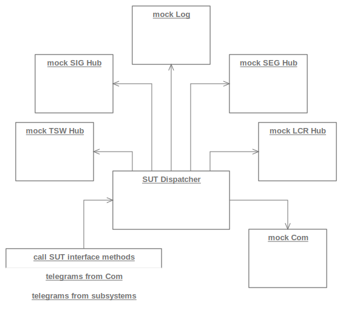
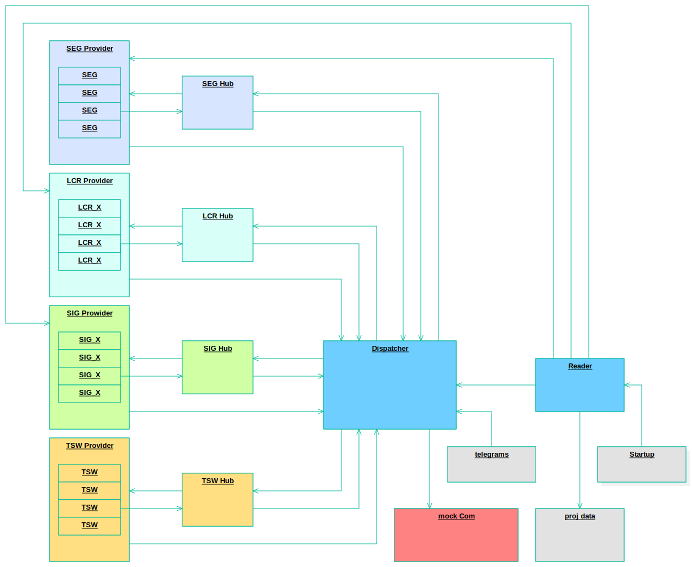

# testing

## CppUTest
CppUTest is the base of testing in this project.

## Interface Locator (IL)
The Interface Locator is a light weight version of the service locator pattern.
In test context every module instance that realizes an interface can be substituted by a mock.
If testing a single application module (SUT, software under test) all other modules are mocked.
-   We describe expected calls to other modules,
-   trigger the SUT by method calls
-   and check if expectations are meat precisely.

In system test context only exit points of the system are mocked.
Triggers take place at the system entry points. 

The software compiled for production does not provide any substitution of the modules in charge.
This concept has been SIL4 validated already.

## module tests

 

Sample: test setup for _Dispatcher_ module

## system tests
entry points:
-   project data
-   telegrams from field and GUI

exit points (Com):
-   telegrams to field and GUI

 

## code coverage
for current current code coverage see [coverage.md](coverage.md)
